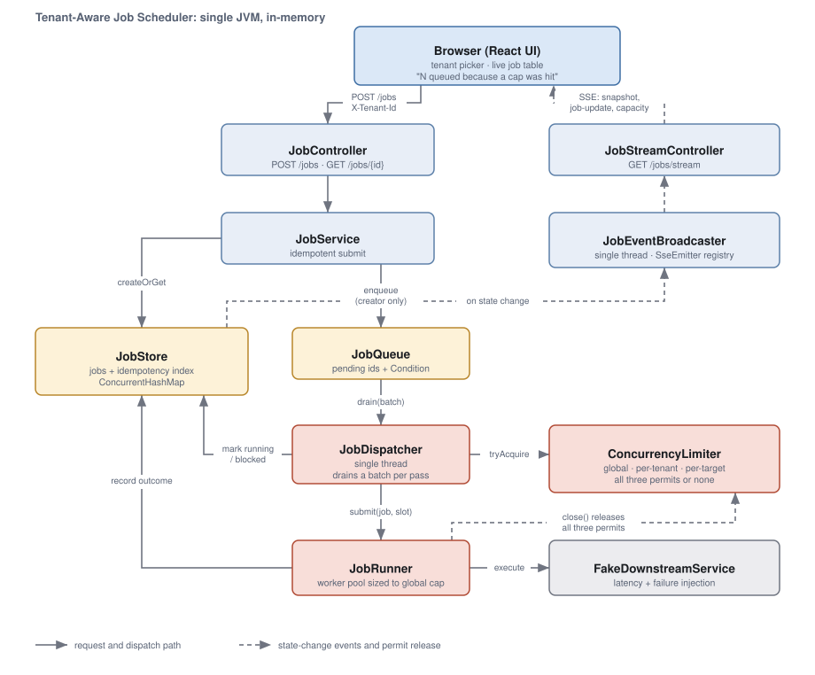

# Tenant-Aware Job Scheduler

A job scheduler that accepts work over HTTP, runs it against a slow and unreliable
downstream, and enforces **three concurrency caps at the same time**: global,
per-tenant, and per-target. Enqueue is idempotent under concurrent duplicates,
failures retry with bounded exponential backoff, and a live SSE stream drives a
small React UI that shows *why* a job is waiting.

Spring Boot 3.5 on Java 21, React 19 on Vite. Everything is held in memory by
design.

## Run it

```bash
./run.sh
```

Then open <http://localhost:8080>.

That is the whole thing: one command, one process, one port. `run.sh` builds the
React app, copies it into Spring's static resources, and starts the server, so
there is no separate dev server and no CORS configuration.

**You need a JDK 21+ and Node/npm.** Nothing else, since Maven ships with the repo
as a wrapper. `run.sh` locates a JDK itself rather than trusting `java` on `PATH`,
because on macOS `/usr/bin/java` is a stub that exists even with no JDK installed
and Homebrew's JDKs are keg-only, so `PATH` gives both false positives and false
negatives. If it cannot find one it tells you how to install it and exits.

Verified end to end from a fresh `git clone` of this repo: `./run.sh` built the
UI, started the server, served the page, and enforced the caps.

### See the caps bite

In the UI, pick a tenant and use the two demo buttons:

- **Send 6 to the same target.** The per-target cap is 1, so one runs and five
  wait on `TARGET_LIMIT`.
- **Send 6 to different targets.** The per-tenant cap is 3, so three run and
  three wait on `TENANT_LIMIT`.

Either way the banner reads **"N jobs are queued because a cap was hit"**, and the
*Why* column names the cap. Open a second browser tab on a different tenant to
watch one tenant throttled while another runs freely.

Or from the shell:

```bash
for i in 1 2 3 4 5 6; do
  curl -s -X POST http://localhost:8080/jobs \
    -H 'Content-Type: application/json' -H 'X-Tenant-Id: tenant-1' \
    -d "{\"tenantId\":\"tenant-1\",\"targetId\":\"reports\",\"payload\":\"p\",\"idempotencyKey\":\"burst-$i\"}" &
done; wait
curl -s http://localhost:8080/jobs -H 'X-Tenant-Id: tenant-1'
```

## Architecture



A submitted job takes this path:

1. `JobController` reads the tenant from `X-Tenant-Id` and rejects a body whose
   `tenantId` disagrees with it.
2. `JobService` asks `JobStore` for the job. The store either creates it or hands
   back the existing one for that idempotency key. **Only the creator enqueues.**
3. `JobDispatcher`, a single thread, drains a batch of pending ids and judges each
   one independently against `ConcurrencyLimiter`.
4. A job that gets all three permits is marked `RUNNING` and handed to
   `JobRunner`'s worker pool. A job that does not is marked with the cap that
   blocked it and put back.
5. `JobRunner` calls the downstream, releases the permits, records the outcome,
   and wakes the dispatcher.
6. Any *visible* state change is published by the store to `JobEventBroadcaster`,
   which pushes it to subscribed browsers.

## The concurrency design

### Three caps, one all-or-nothing decision

Three `Semaphore`s: one global, one per tenant and one per target, the latter two
created on demand via `ConcurrentHashMap.computeIfAbsent`.

The interesting part is not the counting, it is that a job needs **all three
permits or none**:

```java
if (!global.tryAcquire())  return blocked(GLOBAL_LIMIT);
if (!tenant.tryAcquire()) { global.release(); return blocked(TENANT_LIMIT); }
if (!target.tryAcquire()) { tenant.release(); global.release(); return blocked(TARGET_LIMIT); }
```

Every acquisition is `tryAcquire()`, never a blocking `acquire()`. That is the
whole deadlock argument: no thread ever holds one permit while waiting for
another, so hold-and-wait, one of the four conditions deadlock requires, is absent
by construction rather than merely unlikely. Partial acquisitions are rolled back
immediately, so a rejected job leaves the counts exactly as it found them. The
permits are also always taken in the same global, tenant, target order, which
would matter if the acquisitions ever did block.

### Permits are never released by hand

The three permits a running job holds are wrapped in `ConcurrencySlot`, an
`AutoCloseable` used with try-with-resources. Releasing twice is the failure I was
most worried about: `Semaphore.release()` has no ownership check, so a double
release **permanently widens the cap** and the system keeps working while quietly
violating the thing it exists to guarantee. A `compareAndSet` guard makes close
idempotent:

```java
if (!released.compareAndSet(false, true)) return;
```

A read-then-write check would not do, because two threads can both read `false`.

There is a second subtlety in `JobRunner`: try-with-resources closes the slot
*before* the enclosing `finally` runs, so by the time the runner signals the
dispatcher the permits are already back. Signalling first would wake the
dispatcher to find no capacity.

## Idempotency

The index is keyed on **tenantId + idempotencyKey**, so two tenants can both send
`retry-1` without colliding.

Creation happens inside `computeIfAbsent`, not `putIfAbsent`, because the job and
its index entry have to become visible as one step:

```java
String id = idempotencyIndex.computeIfAbsent(scopedKey(tenantId, key), k -> {
    Job job = Job.pending(...);
    jobs.put(job.id(), job);      // published before any other caller sees the id
    created.set(true);
    return job.id();
});
```

With a plain `putIfAbsent` the losing thread receives an id before the winner has
written the job, so an immediate `GET /jobs/{id}` on that id 404s. Enqueueing
happens *after* the lambda returns, gated on the flag it set. That keeps the bin
lock short and guarantees a duplicate request never puts a second copy of the same
id in the queue.

## The dispatcher loop

One thread decides what runs. Three things about it are not obvious:

- **It drains a batch and evaluates each job independently.** A strict
  poll-one-at-a-time loop head-of-line blocks: one job stuck behind a saturated
  target stalls everything behind it, including jobs for entirely different
  tenants.
- **It parks unconditionally when a pass dispatches nothing**, not only when the
  queue is empty. After a pass where every job was blocked the queue is *full* of
  unrunnable work, so a conditional park never parks and the loop hot-spins.
- **The 50 ms park timeout is lost-wakeup insurance, not polling.**
  `Condition.signal()` with no waiter is a no-op, not a banked permit, so a signal
  landing between the dispatcher's last poll and its `await()` would otherwise be
  lost.

## Live updates

`GET /jobs/stream` is Server-Sent Events. SSE rather than WebSocket because the
traffic is entirely server to client, it runs over plain HTTP with no upgrade
handshake, and `EventSource` reconnects on its own for free.

Events are emitted from **`JobStore`**, not from the call sites. The store is the
only place that sees the old and new job atomically, so it is the one place an
emission can be forgotten. The dispatcher, runner and service needed no changes at
all to become event sources. Emission is filtered to genuine changes in status,
block reason or attempt: the dispatcher rewrites blocked jobs on every pass, and
broadcasting those would be an event storm. In one measured run, 8 jobs serialised
on a single target produced **9 `TARGET_LIMIT` events instead of ~2,600**.

Broadcasting runs on its own single thread so a slow browser cannot backpressure
job execution, and subscribe-plus-snapshot happens *on* that thread, because
registering first and snapshotting second is a race in which an update in between
reaches a client that has no baseline for it.

Streams are tenant-filtered by default; `?allTenants=true` gives the admin view.

**Why the stream also accepts `?tenantId=`:** the browser's `EventSource` API
cannot set request headers. That is a hard limitation, not an oversight. The
header still wins when present, and `POST /jobs` remains header-only. The
alternative was a hand-rolled `fetch()` + `ReadableStream` client, which would
have meant reimplementing reconnection to gain consistency I did not need here.

## HTTP API

All endpoints take the tenant from the `X-Tenant-Id` header.

| Method | Path | Notes |
|---|---|---|
| `POST` | `/jobs` | `{tenantId, targetId, payload, idempotencyKey}`. **201** on create, **200** on idempotent replay. Body `tenantId` must match the header or **400**. |
| `GET` | `/jobs` | This tenant's jobs. `?allTenants=true` for every tenant. |
| `GET` | `/jobs/{id}` | **404** if the job belongs to another tenant, deliberately not 403, so an id cannot be probed for existence across tenants. |
| `GET` | `/jobs/stream` | SSE. Events: `snapshot` on connect, then `job-update` and `capacity`, plus a comment heartbeat. Accepts `?tenantId=` and `?allTenants=true`. |

Errors come back as `{error, message, fields?}`.

## Configuration

Defaults live in `src/main/resources/application.yml` and are tuned to make
contention visible in a short demo rather than for throughput.

| Key | Default | Meaning |
|---|---|---|
| `scheduler.concurrency.global-max` | 8 | Jobs running at once, whole server |
| `scheduler.concurrency.per-tenant-max` | 3 | Jobs running at once per tenant |
| `scheduler.concurrency.per-target-max` | 1 | Jobs running at once per target |
| `scheduler.retry.max-attempts` | 3 | Total attempts, so 3 runs and 2 backoffs |
| `scheduler.retry.backoff-base-millis` | 250 | `base * 2^(attempt-1)` |
| `scheduler.downstream.*` | 400-1200 ms, 25% failures | Fake downstream behaviour |
| `scheduler.dispatcher.*` | batch 64, park 50 ms | Dispatcher loop |

`run.sh` forwards its arguments as Spring properties, which is handy for a demo:

```bash
./run.sh --scheduler.downstream.failure-rate=1.0      # make everything fail
./run.sh --scheduler.concurrency.per-tenant-max=1     # make the caps bite harder
```

## Tests

```bash
./mvnw test
```

12 tests, about six seconds. If `java` is not on your `PATH`, prefix it:
`JAVA_HOME=$(/usr/libexec/java_home -v 21) ./mvnw test` on macOS.

The two concurrency-critical paths are the point:

- **`IdempotencyRaceTest`** runs 32 threads that park on a latch and submit the
  same key simultaneously. It asserts exactly one job is created, every caller
  gets the same id, every caller can immediately read that job back, and
  **exactly one entry reaches the queue**.
- **`CapEnforcementTest`** fires bursts of 15 to 20 jobs at a downstream that
  records how many calls were in flight at once. Each case is configured so only
  one cap *can* bind, and each asserts the high-water mark **equals** the cap.
  Equality matters: "never exceeded" would also pass on a run where the cap was
  never reached, which proves nothing.

There is no Awaitility or polling anywhere. Completion is awaited on a
`Semaphore` released by a store listener, so the tests assert on what happened
rather than on wall-clock timing, and the timeouts are only stuck-build guards.

The tests were also checked by breaking the code on purpose: widening the
per-target semaphore by one, and removing the enqueue-once guard, each failed the
tests that claim to cover them.
